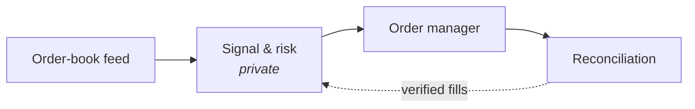
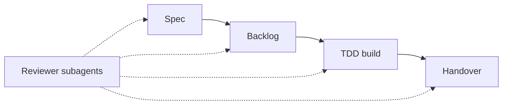

<h1 align="center">Sukhman Virk</h1>

  Software engineer building AI agent platforms and cloud systems by day, and trading systems on the side.

  

  
  
  

## Now

- 🛠️ **At work:** Associate Software Engineer at **Minfy Technologies** (AWS Premier Partner), building agent platforms, RAG systems and multi-tenant SaaS on AWS.
- 📈 **On the side:** running a live automated market maker on prediction markets.

## Choose your lens

<b>📈 Quant / Trading</b>

 

- **Live two-sided market maker** (since Jan 2025): streaming order-book data, requotes on every book update in under 50ms, amend-before-cancel order management, and reconciliation that only credits verified fills. *Strategy and signals are private.*
- **Pandera:** options analytics platform with Black-Scholes implied-volatility inversion, Greeks, and smooth volatility surfaces. LRU caching cut per-query runtime 4×.
- **[`cuda-kernels`](https://github.com/AstuteFern/cuda-toolkit)** on [PyPI](https://pypi.org/project/cuda-kernels/): CUDA-accelerated correlation and sum reduction, 91% faster than NumPy.
- Passed **CFA Level I**. Coursework: Stochastic Processes, Econometrics, Numerical Analysis, Game Theory.

<b>🤖 AI & LLM Systems</b>

 

- **Claude Code delivery platform:** gated stages (spec → backlog → TDD build → handover), 12 reviewer subagents, and 25 service and Terraform templates.
- **Token-cost telemetry** per engineer, project and phase, storing metadata only (no prompt content).
- **Production RAG** on AWS Bedrock with OpenSearch vector search: answers in under 10s, benchmarked against a general-purpose LLM.
- **MCP server** (FastMCP) giving Bedrock agents role-gated tools, with permissions enforced at the tool layer.

<b>☁️ Full-Stack / Cloud</b>

 

- **Multi-tenant data marketplace:** FastAPI backend with Cognito auth and tenant-scoped, cursor-paginated APIs, plus a React/TypeScript dashboard.
- **Multi-tenant admin portal** with role-based access control, in React and Go.
- **Sole engineer on an enterprise geospatial platform**, from scoping to a deployed build in 6 weeks.
- **On-premises → AWS migrations** with zero-downtime cutovers; secure file service handling 10K+ requests/day at 99.99% uptime.
- **Earlier:** C++ WebRTC P2P app at Jio (90% faster connection setup), AES-256 + AWS KMS encryption at HealthCare.com (50K+ records).

## Featured work

### 📈 Prediction-market maker
A live, two-sided market maker running since January 2025. The plumbing is below; the part that decides prices stays private.

### 🤖 Agent delivery platform
An internal Claude Code platform that walks every project through the same gated stages, with reviewer subagents at each gate.

### 🧮 Pandera + cuda-kernels
An options analytics platform (Next.js, Flask, PostgreSQL) with a daily data pipeline, implied-volatility surfaces and Greeks, plus [`cuda-kernels`](https://github.com/AstuteFern/cuda-toolkit), an open-source CUDA library for correlation and sum reduction.

## Stack

| | |
|---|---|
| **Languages** | Python · TypeScript · Go · C++ · SQL · Java |
| **AI** | AWS Bedrock · MCP · RAG · Claude Code |
| **Cloud** | AWS · Terraform · Docker · GitHub Actions |
| **Data** | PostgreSQL · Redis |
| **Quant / ML** | NumPy · Pandas · PyTorch · LightGBM · CUDA |

## Education

**UC San Diego**, B.S. Mathematics–Computer Science · Minors: Cognitive Science, Economics · Provost Honors

## Activity

  

